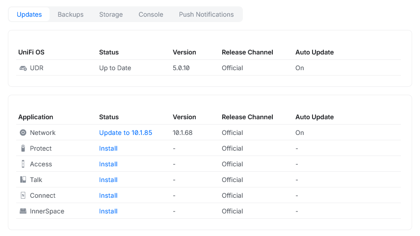
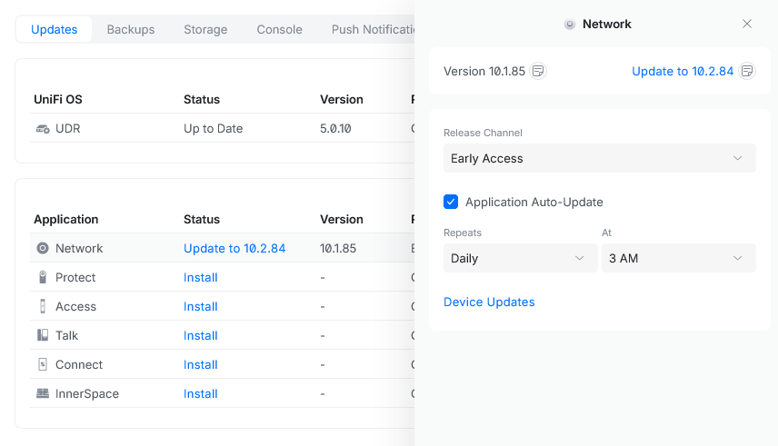

# terraform-unifi-network

Terraform Module for Unifi Network, compatible with Unifi Network API v10.1.68 and greater.

This module (and sub-modules) are based on the official Unifi Documentation:

- https://unifi.ui.com/settings/api-docs
- https://192.168.1.1/unifi-api/network (Assuming 192.168.1.1 is your Unifi Console IP)

## Usage

Checkout the [examples](./examples) folder for detailed examples.

## Features

This module catalogue tries to cover the Unifi endpoints as much as possible.

| **Endpoint**     	         | **Feature**                          	   | **Support** 	 |
|----------------------------|-------------------------------------------|:-------------:|
| N/A             	         | Get Generic API endpoint             	   |      ✅       |
| Application Info 	         | Get Application Info                 	   |      ✅       |
| Sites            	         | List Local Sites                     	   |      ✅       |
| Sites            	         | List Local Sites                     	   |      ✅       |
| Unifi Devices    	         | Adopt Devices                        	   |❌ Not working |
| Unifi Devices    	         | Execute Port Action                  	   |      ❌       |
| Unifi Devices    	         | Execute Adopted Device Action        	   |      ❌       |
| Unifi Devices    	         | Get Adopted Device Details           	   |      ✅       |
| Unifi Devices    	         | Get Latest Adopted Device Statistics 	   |      ✅       |
| Unifi Devices    	         | List Devices Pending Adoption        	   |      ✅       |
| Clients          	         | Execute Client Action                	   |      ❌       |
| Clients          	         | List Connected Clients               	   |      ✅       |
| Clients          	         | Get Connected Client Details         	   |      ✅       |
| Networks         	         | Get Network Details                  	   |      ✅       |
| Networks         	         | Update Network                       	   |      ✅       |
| Networks         	         | Delete Network                       	   |      ✅       |
| Networks         	         | List Networks                        	   |      ✅       |
| Networks         	         | Create Network                       	   | ⚠️ Partial    |
| Networks         	         | Get Network References               	   |      ✅       |
| Wifi Broadcasts            | Get Wifi Broadcast Details                |      ✅       |
| Wifi Broadcasts            | Update Wifi Broadcast                     |      ✅       |
| Wifi Broadcasts            | Delete Wifi Broadcast                     |      ✅       |
| Wifi Broadcasts            | List Wifi Broadcast                       |      ✅       |
| Wifi Broadcasts            | Create Wifi Broadcast                     |      ✅       |
| Hotspot                    | List Vouchers                             |      ❌       |
| Hotspot                    | Generate Vouchers                         |      ❌       |
| Hotspot                    | Delete Vouchers                           |      ❌       |
| Hotspot                    | Get Voucher Details                       |      ❌       |
| Hotspot                    | Delete Voucher                            |      ❌       |
| Firewall                   | Get Firewall Zone                         |      ✅       |
| Firewall                   | Update Firewall Zone                      |      ✅       |
| Firewall                   | Delete Cutom Firewall Zone                |      ✅       |
| Firewall                   | Get Firewall Policy                       |      ❌       |
| Firewall                   | Update Firewall Policy                    |      ❌       |
| Firewall                   | Delete Firewall Policy                    |      ❌       |
| Firewall                   | Patch Firewall Policy                     |      ❌       |
| Firewall                   | Get User-Defined Firewall Policy Ordering |      ❌       |
| Firewall                   | Reorder User-Defined Firewall Policies    |      ❌       |
| Firewall                   | List Firewall Zones                       |      ✅       |
| Firewall                   | Create Custom Firewall Zone               |      ✅       |
| Firewall                   | List Firewall Policies                    |      ❌       |
| Firewall                   | Create Firewall Policy                    |      ❌       |
| Access Control (ACL Rules) | Get ACL Rule                              |      ❌       |
| Access Control (ACL Rules) | Update ACL Rule                           |      ❌       |
| Access Control (ACL Rules) | Delete ACL Rule                           |      ❌       |
| Access Control (ACL Rules) | Get User-Defined ACL Rule Ordering        |      ❌       |
| Access Control (ACL Rules) | Reorder User-Defined ACL Rules            |      ❌       |
| Access Control (ACL Rules) | List ACL Rules                            |      ❌       |
| Access Control (ACL Rules) | Create ACL Rule                           |      ❌       |
| DNS Policies               | Get DNS Policy                            |      ❌       |
| DNS Policies               | Update DNS Policy                         |      ❌       |
| DNS Policies               | Delete DNS Policy                         |      ❌       |
| DNS Policies               | List DNS Policies                         |      ❌       |
| DNS Policies               | Create DNS Policy                         |      ❌       |
| Traffic Matching Lists     | Get Traffic Matching List                 |      ❌       |
| Traffic Matching Lists     | Update Traffic Matching List              |      ❌       |
| Traffic Matching Lists     | Delete Traffic Matching List              |      ❌       |
| Traffic Matching Lists     | List Traffic Matching Lists               |      ❌       |
| Traffic Matching Lists     | Create Traffic Matching List              |      ❌       |
| Supporting Resources       | List WAN interfaces                       |      ✅       |
| Supporting Resources       | List Site-to-Site VPN Tunnels             |      ✅       |
| Supporting Resources       | List VPN Servers                          |      ✅       |
| Supporting Resources       | List Radius Profiles                      |      ✅       |
| Supporting Resources       | List Device Tags                          |      ✅       |
| Supporting Resources       | List DPI Application Categories           |      ✅       |
| Supporting Resources       | List DPI Applications                     |      ✅       |
| Supporting Resources       | List Countries                            |      ✅       |

The first row "Get Generic API endpoint" reference the [`./modules/generic_get_client`](./modules/generic_get_client) submodule and can be used to query (Get only) any Unifi Network API endpoint that is not yet implemented in this module.

## Common Issues

### tls: failed to verify certificate

```bash
╷
│ Error: Error to call Read
│
│   with module.sites.data.restful_resource.sites,
│   on ..\..\modules\sites\main.tf line 1, in data "restful_resource" "sites":
│    1: data "restful_resource" "sites" {
│
│ Get "https://192.168.1.1/proxy/network/integration/v1/sites": tls: failed to verify certificate: x509: certificate signed by
│ unknown authority
╵
```

This can happen when you are using the `local` API endpoint because your Unifi Console uses by default a self-signed certificate (`e.g. CN=unifi.local`).

To fix this issue you can either:
- Verify that your `magodo/restful` provider has the `tls_insecure_skip_verify` parameter set to `true` when using a local endpoint (See [`./examples/get_application_info/terraform.tf`](./examples/get_application_info/terraform.tf#L24))
- Add a trusted certificate to your Unifi Console (Settings > Console Plane > Certificates > Add new)


### i/o timeout

```bash
╷
│ Error: Error to call Read
│
│   with module.sites.data.restful_resource.sites,
│   on ../../modules/sites/main.tf line 1, in data "restful_resource" "sites":
│    1: data "restful_resource" "sites" {
│
│ Get "https://192.168.1.1/proxy/network/integration/v1/sites": dial tcp 192.168.1.1:443: i/o timeout
╵
```

This can happen when using WSL2 on Windows after a long day of development. Simply restart your linux distro to fix it.

### api.unexpected-error

```bash
╷
│ Error: Create API returns 500
│
│   with module.network.restful_resource.network,
│   on ..\..\modules\network\main.tf line 1, in resource "restful_resource" "network":
│    1: resource "restful_resource" "network" {
│
│ {"statusCode":500,"statusName":"INTERNAL_SERVER_ERROR","code":"api.unexpected-error","message":"Unexpected
│ error","timestamp":"2026-03-07T12:57:20.718469661Z","requestPath":"/integration/v1/sites/aff94e4d-ee24-3933-a31b-6d133aeb9856/networks","requestId":"87c3ebef-6d7f-4f25-90b7-fd0a44cf5bc0"}
╵
```

This can happen when the Unifi Network Application is not up to date.



Please check via Settings > Console Plane > Updates and check both "Unifi OS" and "Network Application" updates.

Please also note the minimum API version supported in the module's README. Sometimes this can be an early access version. If this is the case you must first enable this option in your UI account ([Account Settings](https://account.ui.com) > Enable `Early Access`) and then change the release channel to "Early Access" in your Unifi Console Plane.



If you are using the latest version and still have an error, please [open issue](https://github.com/alexandre-pares/terraform-unifi-network/issues/new/choose).

Additionally, this error can happen when using incompatible arguments (e.g. Try to create a network associated to the `Hotspot` firewall zone with `enable_isolation` enabled - `enable_isolation` must be disabled). Therefore, please check the API documentation and/or try to create manually the same resource via the (local/remote) UI of your Unifi Console.

## Disclaimer

This module is not an official module from Ubiquiti Inc.

I only have access to limited Unifi hardware so not all endpoints can be implemented or tested.

I'm learning Terraform and will try to improve the modules over time. (I'm looking over [`terraform query`](https://developer.hashicorp.com/terraform/cli/commands/query), [`terraform test`](https://developer.hashicorp.com/terraform/cli/commands/test) and maybe one day on a terraform provider).

## Inspiration

- [terraform-ibm-modules/common-dev-assets](https://github.com/terraform-ibm-modules/common-dev-assets/blob/main/module-assets/.pre-commit-config.yaml) for pre-commits
- [Azure/terraform-azurerm-avm-template](https://github.com/Azure/terraform-azurerm-avm-template/blob/main/outputs.tf) for TF variables and outputs descriptions format
- [Azure/terraform-azurerm-lz-vending](https://github.com/Azure/terraform-azurerm-lz-vending/blob/ddc6b5989a01e658250b998285c8dccb7b3afa30/docs/wiki/Example-3-YAML-data-files.md?plain=1#L31)


<!-- BEGIN_TF_DOCS -->
## Requirements

| Name | Version |
|------|---------|
| <a name="requirement_terraform"></a> [terraform](#requirement\_terraform) | ~> 1.14 |

## Providers

No providers.

## Modules

| Name | Source | Version |
|------|--------|---------|
| <a name="module_application_info"></a> [application\_info](#module\_application\_info) | ./modules/application_info | n/a |
| <a name="module_firewall_zone"></a> [firewall\_zone](#module\_firewall\_zone) | ./modules/firewall_zone | n/a |
| <a name="module_network"></a> [network](#module\_network) | ./modules/network | n/a |
| <a name="module_wifi_broadcast"></a> [wifi\_broadcast](#module\_wifi\_broadcast) | ./modules/wifi | n/a |

## Resources

No resources.

## Inputs

| Name | Description | Type | Default | Required |
|------|-------------|------|---------|:--------:|
| <a name="input_firewall_zones"></a> [firewall\_zones](#input\_firewall\_zones) | (Optional) A map of firewall zones to create<br/><br/>  - `name` - Name of the firewall zone<br/>  - `network_ids` - (Optional) List of network id to attach to this firewall zone. | <pre>map(object({<br/>    name        = string<br/>    network_ids = optional(list(string))<br/>  }))</pre> | `{}` | no |
| <a name="input_networks"></a> [networks](#input\_networks) | (Optional) A map of networks to create<br/><br/>  - `management_type` - Type of management.<br/>  - `name` - Name of the network.<br/>  - `enabled` - (Optional) Whether the network is enabled.<br/>  - `vlan_id` - VLAN ID of the network.<br/>  - `enable_isolation` - (Optional) Whether this network is isolated from all other networks.<br/>  - `enable_cellular_backup` - (Optional) Whether this network is allowed to use cellular data when WAN connection(s) are down.<br/>  - `firewall_zone_id` - (Optional) Firewall zone ID associated with this Network.<br/>  - `enable_internet_access` - (Optional) Whether the internet access is allowed for the device on this network.<br/>  - `enable_mdns_forwarding` - (Optional) Whether this network should participate in mDNS traffic forwarding.<br/><br/>  ---<br/>  `dhcp_guarding` supports the following:<br/>  - `trusted_dhcp_server_ip_addresses` - (Optional) List of trusted DHCP server IP addresses.<br/><br/>  ---<br/>  `ipv4_configuration` - IPv4 Configuration - supports the following:<br/>  - `enable_auto_scale` - Whether the Network can automatically scale its subnet size based on the number of active DHCP leases.<br/>  - `host_ip_address` - Address of the host network<br/>  - `prefix_length` - CIDR of the network<br/>  - `additional_host_ip_subnets` - (Optional) Additional host IP subnets assigned to this VLAN.<br/>  - `dhcp_configuration` - IPv4 DHCP configuration for this network - supports the following:<br/>    - `mode` - SERVER or RELAY<br/>    - `ip_address_range` - Start and end IP range - supports the following:<br/>      - `start` - Start of IP range<br/>      - `stop` - End of IP range<br/>    - `override_gateway_ip_address` - (Optional) Gateway IP address provided to DHCP clients.<br/>    - `override_dns_server_ip_addresses` - (Optional) List of DNS servers assigned to client devices by the DHCP server.<br/>    - `lease_time_seconds` - (Optional) The lease time in seconds for addresses in this range.<br/>    - `domain_name` - (Optional) Domain name that can be used to access network in the browser.<br/>    - `enable_ping_conflict_detection` - (Optional) Verify an IP address is unused by sending a ping before leasing it.<br/>    - `pxe_configuration` - Pre execution environment configuration for network boot - supports the following:<br/>      - `server_ip_address` - IP Address of the PXE server<br/>      - `filename` - Filename to fetch<br/>    - `ntp_server_ip_addresses` - (Optional) Network Time Protocol (NTP) server IP addresses.<br/>    - `option_43_value` - (Optional) Custom DHCP option (43)<br/>    - `tftp_server_address` - (Optional) Trivial File Transfer Protocol (TFTP) server address<br/>    - `time_offset_seconds` - (Optional) Time offset in seconds from UTC.<br/>    - `wpad_url` - (Optional) Web Proxy Auto-Discovery (WPAD) URL.<br/>    - `wins_server_ip_addresses` - (Optional) Windows Internet Name Service (WINS) server IP addresses.<br/>    - `dhcp_server_ip_addresses` - (Optional) DHCP Server IP addresses<br/>  - `nat_outbound_ip_address_configuration` - Array of object (WAN NAT Outbound Configuration) - supports the following:<br/>    - `type` - AUTO or STATIC<br/>    - `wan_interface_ip` - WAN Interface IP<br/>    - `ip_address_selection_mode` - (Optional) IP address selection mode which determines how the IP address will be selected from the group of IP addresses to translate the traffic on network using NAT.<br/>    - `ip_address_selectors` - List of IP addresses or address ranges which determines which IP addresses - supports the following:<br/>      - `type` - IP\_ADDRESS or IP\_ADDRESS\_RANGE<br/>      - `value` - (Optional)<br/>      - `start` - (Optional)<br/>      - `stop` - (Optional)<br/><br/>  ---<br/>  `ipv6_configuration` - IPv6 Configuration - supports the following:<br/>  - `interface_type` - IPv6 type to use<br/>  - `client_address_assignment` - Client Address Assignment - supports the following:<br/>    - `dhcp_configuration` - (Optional) DHCP Configuration - supports the following:<br/>      - `ip_address_suffix_range` supports the following:<br/>        - `start` - Start suffix of the DHCPv6 address pool.<br/>        - `stop` - End suffix of the DHCPv6 address pool.<br/>      - `lease_time_seconds` - The lease time in seconds for IP addresses in this range.<br/>    - `enable_slaac` - Allows devices to obtain IPv6 addresses via SLAAC (Stateless Address Autoconfiguration) without DHCPv6.<br/>  - `router_advertisement` - (Optional) Router advertisement (RA) supports the following:<br/>    - `priority` - Router advertisement priority.<br/>  - `override_dns_server_ip_addresses` - (Optional) The IPv6 DNS server addresses assigned to this Network.<br/>  - `additional_host_ip_subnets` - (Optional) Additional host IP subnets assigned to this VLAN.<br/>  - `host_ip_address` - (Optional) The static IPv6 address assigned to this Network.<br/>  - `prefix_length` - (Optional) CIDR<br/>  - `prefix_delegation_wan_interface_id` - (Optional) ID of the WAN interface from which the prefix is delegated. | <pre>map(object({<br/>    management_type = string<br/>    name            = string<br/>    enabled         = optional(bool)<br/>    vlan_id         = number<br/>    dhcp_guarding = optional(object({<br/>      trusted_dhcp_server_ip_addresses = optional(list(string))<br/>    }))<br/>    enable_isolation       = optional(bool)<br/>    enable_cellular_backup = optional(bool)<br/>    firewall_zone_id       = optional(string)<br/>    enable_internet_access = optional(bool)<br/>    enable_mdns_forwarding = optional(bool)<br/>    ipv4_configuration = optional(object({<br/>      # Whether the Network can automatically scale its subnet size based on the number of active DHCP leases.<br/>      enable_auto_scale = bool<br/><br/>      # Address of the host network<br/>      host_ip_address = string<br/><br/>      # CIDR of the network<br/>      prefix_length = number<br/><br/>      # Additional host IP subnets assigned to this VLAN.<br/>      additional_host_ip_subnets = optional(list(string))<br/><br/>      # IPv4 DHCP configuration for this network.<br/>      # If this field is omitted or null, DHCP is not working and hosts must get an address statically<br/>      # or from another server in this broadcast domain.<br/>      dhcp_configuration = optional(object({<br/>        # SERVER or RELAY<br/>        mode = string<br/><br/>        # Start and end IP range<br/>        # If null, the first and last IP addresses available in the IP range will be used<br/>        ip_address_range = optional(object({<br/>          start = string<br/>          stop  = string<br/>        }))<br/><br/>        # Gateway IP address provided to DHCP clients.<br/>        # If null, the default gateway will be assigned.<br/>        override_gateway_ip_address = optional(string)<br/><br/>        # List of DNS servers assigned to client devices by the DHCP server.<br/>        # If none are specified, they will be selected automatically.<br/>        override_dns_server_ip_addresses = optional(list(string))<br/><br/>        # The lease time in seconds for addresses in this range.<br/>        lease_time_seconds = optional(number)<br/><br/>        # Domain name that can be used to access network in the browser.<br/>        domain_name = optional(string)<br/><br/>        # Verify an IP address is unused by sending a ping before leasing it.<br/>        enable_ping_conflict_detection = optional(bool)<br/><br/>        # Pre execution environment configuration for network boot<br/>        pxe_configuration = optional(object({<br/>          # IP Address of the PXE server<br/>          server_ip_address = string<br/><br/>          # Filename to fetch<br/>          # Example: boot\x64\wdsnbp.com<br/>          filename = string<br/>        }))<br/><br/>        # Network Time Protocol (NTP) server IP addresses.<br/>        # Max 2 servers<br/>        # doesn't support domain, must be an IP<br/>        ntp_server_ip_addresses = optional(list(string))<br/><br/>        # Custom DHCP option (43)<br/>        # the value MUST be the UniFi Network application's host IP address.<br/>        option_43_value = optional(string)<br/><br/>        # Trivial File Transfer Protocol (TFTP) server address<br/>        # accepts a hostname, URL or IP address.<br/>        tftp_server_address = optional(string)<br/><br/>        # Time offset in seconds from UTC.<br/>        time_offset_seconds = optional(number)<br/><br/>        # Web Proxy Auto-Discovery (WPAD) URL.<br/>        wpad_url = optional(string)<br/><br/>        # Windows Internet Name Service (WINS) server IP addresses.<br/>        wins_server_ip_addresses = optional(list(string))<br/><br/>        # DHCP Server IP addresses<br/>        # Required if mode is RELAY, not required if mode is SERVER<br/>        dhcp_server_ip_addresses = optional(list(string))<br/>      }))<br/><br/>      # Array of object (WAN NAT Outbound Configuration)<br/>      nat_outbound_ip_address_configuration = optional(list(object({<br/>        # AUTO or STATIC<br/>        type = string<br/><br/>        # WAN interface IP<br/>        wan_interface_ip = string<br/><br/>        # IP address selection mode which determines how the IP address will be selected<br/>        # from the group of IP addresses to translate the traffic on network using NAT.<br/>        # Required if type is AUTO<br/>        ip_address_selection_mode = optional(string)<br/><br/>        # List of IP addresses or address ranges which determines which IP addresses<br/>        # will be used to translate the traffic on network using NAT.<br/>        ip_address_selectors = optional(set(object({<br/>          # IP_ADDRESS or IP_ADDRESS_RANGE<br/>          type  = string<br/>          value = optional(string)<br/>          start = optional(string)<br/>          stop  = optional(string)<br/>        })))<br/><br/>      })))<br/><br/>    }))<br/>    ipv6_configuration = optional(object({<br/>      # IPv6 type to use<br/>      # - PREFIX_DELEGATION<br/>      # - STATIC<br/>      interface_type = string<br/><br/>      # Client Address Assignment<br/>      client_address_assignment = object({<br/>        # DHCP Configuration<br/>        dhcp_configuration = optional(object({<br/>          ip_address_suffix_range = object({<br/>            # Start suffix of the DHCPv6 address pool.<br/>            start = string<br/>            # End suffix of the DHCPv6 address pool.<br/>            stop = string<br/>          })<br/>          # The lease time in seconds for IP addresses in this range.<br/>          lease_time_seconds = number<br/>        }))<br/><br/>        # SLAAC<br/>        # Allows devices to obtain IPv6 addresses via SLAAC (Stateless Address Autoconfiguration) without DHCPv6.<br/>        # At least one addressing method must be active: either enable SLAAC or provide DHCP configuration.<br/>        enable_slaac = bool<br/>      })<br/><br/>      # Router advertisement (RA).<br/>      # Without it, hosts will not autoconfigure addresses and will lack a default route even with DHCPv6.<br/>      router_advertisement = optional(object({<br/>        # Router advertisement priority.<br/>        # - LOW<br/>        # - MEDIUM<br/>        # - HIGH<br/>        priority = string<br/>      }))<br/><br/>      # The IPv6 DNS server addresses assigned to this Network.<br/>      # If none are specified, they will be selected automatically.<br/>      override_dns_server_ip_addresses = optional(list(string))<br/><br/>      # Additional host IP subnets assigned to this VLAN.<br/>      additional_host_ip_subnets = optional(list(string))<br/><br/>      # The static IPv6 address assigned to this Network.<br/>      host_ip_address = optional(string)<br/><br/>      # CIDR<br/>      prefix_length = optional(number)<br/><br/>      # ID of the WAN interface from which the prefix is delegated.<br/>      prefix_delegation_wan_interface_id = optional(string)<br/>    }))<br/>    device_id = optional(string)<br/>  }))</pre> | `{}` | no |
| <a name="input_site_id"></a> [site\_id](#input\_site\_id) | Unifi site Id. | `string` | n/a | yes |
| <a name="input_wifi_broadcasts"></a> [wifi\_broadcasts](#input\_wifi\_broadcasts) | (Optional) A map of WiFi broadcasts to create<br/><br/>  - `type` - Type of WiFi broadcast. Possible values are `STANDARD` and `IOT_OPTIMIZED`.<br/>  - `name` - Name of the WiFi broadcast.<br/>  - `enabled` - Whether the WiFi broadcast is enabled or not.<br/>  - `enable_multicast_to_unicast_conversion` - Converts multicast WiFi traffic to unicast, when possible.<br/>  - `enable_client_isolation` - Enable client isolation.<br/>  - `hide_wifi_name` - Hide WiFi Network name.<br/>  - `enable_uapsd` - Enable Unscheduled Automatic Power Save Delivery (U-APSD).<br/>  - `broadcasting_frequencies_ghz` - List of Broadcasting frequencies in Ghz. Possible values are defined by access point capabilities.<br/>  - `enable_mlo` - Enable Multi-Link Operation (MLO).<br/>  - `enable_band_steering` - Enable Band Sterring.<br/>  - `enable_arp_proxy` - Enable ARP Proxy. Reduces airtime usage by allowing APs to 'proxy' common broadcast frames as unicast.<br/>  - `enable_bss_transition` - Enable BSS Transition.<br/>  - `advertise_device_name` - Indicates whether the device name is advertised in beacon frames.<br/><br/>  ---<br/>  - `network` - Network to attached the WiFi broadcast to.<br/>    - `type` - Type of the network. Possible values are `NATIVE` and `SPECIFIC`<br/>    - `network_id` - Id of the network. Required if `type` is `SPECIFIC`<br/><br/>  ---<br/>  - `security_configuration` - Security configuration of the WiFi broadcast.<br/>    - `type` - Security type of the WiFi broadcast. Possible values are `OPEN`, `WPA2_PERSONAL`, `WPA3_PERSONAL`, `WPA2_WPA3_PERSONAL`, `WPA2_ENTERPRISE`, `WPA3_ENTERPRISE` and `WPA2_WPA3_ENTERPRISE`.<br/>    - `group_rekey_interval_seconds` - Group rekey interval in seconds. Sets how often connected device groups are assigned a new key. If null, then it is disabled. This feature is not available for IoT configuration.<br/>    - `enable_fast_roaming` - Fast roaming enabled flag. This feature is not available for IoT configuration or OPEN security. You will experience connectivity issues with devices that do not support the 802.11r WiFi standard.<br/>    - `passphrase` - Passphrase. Required when type is `WPA2_PERSONAL`, `WPA3_PERSONAL` or `WPA2_WPA3_PERSONAL`<br/>    - `pmf_mode` - Protected Management Frames mode. If null, then it is disabled. This feature is not available for IoT configuration.<br/>    - `enable_wpa3_fast_roaming` - WPA3 fast roaming can be enabled only if the default fast roaming is enabled.<br/>    - `enable_coa` - Indicates whether Change of Authorization (COA) is enabled.<br/>    - `security_mode` - Security mode. Possible values are `PERSONAL`<br/>    - `radius_configuration` - Radius configuration<br/>      - `profile_id` - Radius profile Id. You can use the `radius_profiles` sub-module to get the radius profile id.<br/>      - `nas_id` - WiFi Radius NAS Id.<br/>        - `type` - Type of the NAS Id. Possible values are `DERIVED` and `USER_DEFINED`.<br/>        - `source` - Source of the NAS Id. Required if the NAS Id type is `DERIVED`.<br/>        - `value` - Value of the NAS Id. Required if the NAS Id type is `USER_DEFINED`.<br/>      - `mac_authentication_configuration` - MAC Authentication configuration.<br/>        - `mac_address_format` - MAC address format.<br/>    - `sae_configuration` - Configuration for SAE (Simultaneous Authentication of Equals).<br/>      - `anticlogging_threshold_seconds` - SAE Anti-clogging<br/>      - `sync_time_seconds` - SAE Sync Time<br/>    - `pre_shared_keys` - List of pre-shared keys. Required when type is `WPA2_PERSONAL`, `WPA3_PERSONAL` or `WPA2_WPA3_PERSONAL`. This is an alternative to using the `passphrase` variable and allows you to set different passphrases for different VLANs.<br/>      - `network` - Network configuration for the pre-shared key.<br/>        - `type` - Type of the network. Possible values are `NATIVE` and `SPECIFIC`. If `SPECIFIC` is used, the `network_id` key must be set.<br/>        - `network_id` - Network Id. Required if the network type is `SPECIFIC`.<br/>      - `passphrase` - Passphrase for the pre-shared key.<br/>    - `sae_configuration` - Configuration for SAE (Simultaneous Authentication of Equals).<br/>      - `anticlogging_threshold_seconds`<br/>      - `sync_time_seconds`<br/><br/>  ---<br/>  - `broadcasting_device_filter` - Defines the custom scope of devices that will broadcast this WiFi network.<br/>    - `type` - Type of the filter. Possible values are `DEVICES` and `DEVICE_TAGS`.<br/>    - `device_ids` - List of Access Point capable device IDs to which the WiFi broadcast applies. Required if the filter type is `DEVICES`. You can use the `devices` sub-module to get the device ids.<br/>    - `device_tags_ids` - List device tag IDs to which the WiFi broadcast applies. Required if the filter type is `DEVICE_TAGS`. You can use the `device_tags` sub-module to get the device tag ids.<br/><br/>  ---<br/>  - `mdns_proxy_configuration` - mDNS filtering configuration.<br/>    - `mode` - mDNS proxy mode. Possible values are `AUTO` and `CUSTOM`.<br/>    - `policies` - Array of mDNS proxy policies. Required if the mode is `CUSTOM`.<br/>      - `action` - Action to apply for matching mDNS traffic. Possible values are `ALLOW`and `BLOCK`<br/>      - `device_filter` - Defines the custom scope of devices that will filter Mdns. If null, the mDNS filtering will be added to all Access Point capable devices.<br/>      - `service_filter` - Array of object (mDNS service)<br/>        - `type` - `PREDEFINED` or `CUSTOM`<br/>        - `name` - Name of the service.<br/>        - `type_domain` - Type domain of the service. Required if the service type is `CUSTOM`.<br/>      - `bridging_network_ids` - Array of network ids.<br/><br/>  ---<br/>  - `multicast_filtering_policy` - Multicast filtering policy.<br/>    - `action` - Action to apply for matching multicast traffic. Possible values are `ALLOW`and `BLOCK`<br/>    - `source_mac_address_filter` - List of multicast source MAC addresses allowed. Multicast traffic from gateways is always allowed. Required if action is ALLOW.<br/><br/>  ---<br/>  - `basic_data_rate_kbps_by_frequency_ghz` - Basic data rates in Kbps by frequency in Ghz.<br/>    - `2.4` - List of data rates for the 2.4 Ghz band<br/>    - `5` - List of data rates for the 5 Ghz band<br/><br/>  ---<br/>  - `client_filtering_policy` - Client connection filtering policy.<br/>    - `action` - Action to apply. Possible values are `BLOCK` and `ALLOW`.<br/>    - `mac_address_filter` - List of client MAC addresses.<br/><br/>  ---<br/>  - `blackout_schedule_configuration` - Time when this WiFi is disabled.<br/>    - `days` - List of days when the WiFi is disabled<br/>      - `type` - Type of blackout. Possible values are `ALL_DAY` and `TIME_RANGE`.<br/>      - `day` - Day of the week when the WiFi is disabled. Required when `type` is `ALL_DAY`<br/>      - `time_ranges` - List of time ranges<br/>        - `start_time` - Start time in 24-hour format (HH:mm)<br/>        - `end_time` - End time in 24-hour format (HH:mm)<br/><br/>  ---<br/>  - `hotspot_configuration` - WiFi Hotspot configuration.<br/>    - `type` - Type of WiFi hotspot. Possible values are `CAPTIVE_PORTAL` and `PASSPOINT`.<br/><br/>  ---<br/>  - `dtim_period_by_frequency_ghz_override` - DTIM (Delivery Traffic Indication Message) period override by frequency in Ghz.<br/>    - `2.4` - DTIM period override for the 2.4 Ghz band<br/>    - `5` - DTIM period override for the 5 Ghz band<br/>    - `6` - DTIM period override for the 6 Ghz band (if supported by the access points) | <pre>map(object({<br/>    type = optional(string)<br/>    name = string<br/>    network = optional(object({<br/>      type       = string<br/>      network_id = optional(string)<br/>    }))<br/>    enabled = optional(bool)<br/>    security_configuration = optional(object({<br/>      type = string<br/>      radius_configuration = optional(object({<br/>        profile_id = string<br/>        nas_id = object({<br/>          # DERIVED or USER_DEFINED<br/>          type   = string<br/>          source = optional(string)<br/>          value  = optional(string)<br/>        })<br/>        mac_authentication_configuration = optional(object({<br/>          mac_address_format = string<br/>        }))<br/>      }))<br/>      # Group rekey interval in seconds. Sets how often connected device groups are assigned a new key.<br/>      # If null, then it is disabled. This feature is not available for IoT configuration.<br/>      group_rekey_interval_seconds = optional(number)<br/><br/>      # Fast roaming enabled flag. This feature is not available for IoT configuration.<br/>      enable_fast_roaming = optional(bool)<br/><br/>      # Passphrase to connect to the WiFi.<br/>      passphrase = optional(string)<br/><br/>      # Pre-shared keys.<br/>      pre_shared_keys = optional(list(object({<br/>        network = object({<br/>          type       = string<br/>          network_id = optional(string)<br/>        })<br/>        passphrase = string<br/>      })))<br/><br/>      # Protected Management Frames mode.<br/>      # If null, then it is disabled. This feature is not available for IoT configuration.<br/>      pmf_mode = optional(string)<br/><br/>      # WPA3 fast roaming can be enabled only if the default fast roaming is enabled<br/>      enable_wpa3_fast_roaming = optional(bool)<br/><br/>      # Configuration for SAE (Simultaneous Authentication of Equals).<br/>      sae_configuration = optional(object({<br/>        anticlogging_threshold_seconds = number<br/>        sync_time_seconds              = number<br/>      }))<br/><br/>      # Enable COA<br/>      # Indicates whether Change of Authorization (COA) is enabled<br/>      enable_coa = optional(bool)<br/><br/>      # Security Mode<br/>      security_mode = optional(string)<br/>    }))<br/>    broadcasting_device_filter = optional(object({<br/>      type           = string<br/>      device_ids     = optional(list(string))<br/>      device_tag_ids = optional(list(string))<br/>    }))<br/>    mdns_proxy_configuration = optional(object({<br/>      mode = string<br/>      policies = optional(list(object({<br/>        action = string<br/>        device_filter = optional(object({<br/>          action = string<br/>          device_filter = optional(object({<br/>            type           = string<br/>            device_ids     = optional(list(string))<br/>            device_tag_ids = optional(list(string))<br/>          }))<br/>          service_filter = optional(list(object({<br/>            type        = string<br/>            name        = optional(string)<br/>            type_domain = optional(string)<br/>          })))<br/>          bridging_network_ids = optional(list(string))<br/>        }))<br/>      })))<br/>    }))<br/>    multicast_filtering_policy = optional(object({<br/>      action                    = string<br/>      source_mac_address_filter = optional(list(string))<br/>    }))<br/>    enable_multicast_to_unicast_conversion = optional(bool)<br/>    enable_client_isolation                = optional(bool)<br/>    hide_wifi_name                         = optional(bool)<br/>    enable_uapsd                           = optional(bool)<br/>    basic_data_rate_kbps_by_frequency_ghz  = optional(map(list(number)))<br/>    client_filtering_policy = optional(object({<br/>      action             = string<br/>      mac_address_filter = list(string)<br/>    }))<br/>    blackout_schedule_configuration = optional(object({<br/>      days = list(object({<br/>        # ALL_DAY or TIME_RANGE<br/>        type = string<br/>        day  = string<br/>        time_ranges = optional(list(object({<br/>          # Start time in 24-hour format (HH:mm)<br/>          start_time = string<br/>          # End time in 24-hour format (HH:mm)<br/>          end_time = string<br/>        })))<br/>      }))<br/>    }))<br/>    broadcasting_frequencies_ghz = optional(list(number))<br/>    hotspot_configuration = optional(object({<br/>      # CAPTIVE_PORTAL or PASSPOINT<br/>      type = string<br/>    }))<br/>    enable_mlo                            = optional(bool)<br/>    enable_band_steering                  = optional(bool)<br/>    enable_arp_proxy                      = optional(bool)<br/>    enable_bss_transition                 = optional(bool)<br/>    advertise_device_name                 = optional(bool)<br/>    dtim_period_by_frequency_ghz_override = optional(map(number))<br/>  }))</pre> | `{}` | no |

## Outputs

| Name | Description |
|------|-------------|
| <a name="output_application_info"></a> [application\_info](#output\_application\_info) | ## Description<br/><br/>  Unifi Application Information.<br/><br/>  ## Learn more<br/><br/>  https://developer.ui.com/network/v10.1.68/getinfo<br/><br/>  ## Example<pre>hcl<br/>  {<br/>    "applicationVersion" = "10.1.68"<br/>  }</pre> |
| <a name="output_firewall_zones"></a> [firewall\_zones](#output\_firewall\_zones) | ## Description<br/><br/>  Map of Firewall Zone details.<br/><br/>  ## Learn more<br/><br/>  https://developer.ui.com/network/v10.1.84/getfirewallzonedetails<br/><br/>  ## Example<pre>hcl<br/>  {<br/>    fwz_hotspot_custom.yaml = {<br/>      id = "857f712f-2f81-44a0-a16b-c4d00a9d8199"<br/>      metadata = {<br/>        origin = "USER_DEFINED"<br/>      }<br/>      name = "Hotspot_custom"<br/>      networkIds = []<br/>    }<br/>    fwz_internal_custom.yaml = {<br/>      id = "c0ee79a3-b05d-4133-8ad9-fa87b35c4eee"<br/>      metadata = {<br/>        origin = "USER_DEFINED"<br/>      }<br/>      name = "Internal_custom"<br/>      networkIds = []<br/>    }<br/>    vpn_custom = {<br/>      id = "bd172af0-0fdf-426c-a89c-42d438a572d4"<br/>      metadata = {<br/>        origin = "USER_DEFINED"<br/>      }<br/>      name = "Vpn_custom"<br/>      networkIds = []<br/>    }<br/>  }</pre> |
| <a name="output_networks"></a> [networks](#output\_networks) | ## Description<br/><br/>  Map of created network details.<br/><br/>  ## Learn more<br/><br/>  https://developer.ui.com/network/v10.1.68/getnetworkdetails<br/><br/>  ## Example<pre>hcl<br/>  {<br/>    network_001 = {<br/>      cellularBackupEnabled = false<br/>      default               = true<br/>      enabled               = true<br/>      id                    = "1a25e9d4-8864-49d5-abc4-fffc47905326"<br/>      internetAccessEnabled = true<br/>      ipv4Configuration     = {<br/>        autoScaleEnabled  = true<br/>        dhcpConfiguration = {<br/>            domainName                   = "local-domain.tld"<br/>            ipAddressRange               = {<br/>                start = "192.168.1.6"<br/>                stop  = "192.168.1.254"<br/>              }<br/>            leaseTimeSeconds             = 86400<br/>            mode                         = "SERVER"<br/>            pingConflictDetectionEnabled = true<br/>          }<br/>        hostIpAddress     = "192.168.1.1"<br/>        prefixLength      = 24<br/>      }<br/>    ipv6Configuration     = {<br/>      clientAddressAssignment        = {<br/>        slaacEnabled = true<br/>      }<br/>      interfaceType                  = "PREFIX_DELEGATION"<br/>      prefixDelegationWanInterfaceId = "d7a6a629-5696-4140-ae5f-50a29bc04061"<br/>      routerAdvertisement            = {<br/>        priority = "HIGH"<br/>      }<br/>      }<br/>      isolationEnabled      = false<br/>      management            = "GATEWAY"<br/>      mdnsForwardingEnabled = true<br/>      metadata              = {<br/>        configurable = true<br/>        origin       = "SYSTEM_DEFINED"<br/>      }<br/>      name                  = "Default"<br/>      vlanId                = 1<br/>      zoneId                = "b54d3153-7f14-4aaf-9ceb-95a5a08d5519"<br/>    }<br/>  }</pre> |
| <a name="output_wifi_broadcasts"></a> [wifi\_broadcasts](#output\_wifi\_broadcasts) | ## Description<br/><br/>  Map of WiFi Broadcast details.<br/><br/>  ## Learn more<br/><br/>  https://developer.ui.com/network/v10.1.84/getwifibroadcastdetails<br/><br/>  ## Example<pre>hcl<br/>  {<br/>    "wifi_guest" = {<br/>      "advertiseDeviceName" = false<br/>      "arpProxyEnabled" = false<br/>      "bandSteeringEnabled" = true<br/>      "broadcastingFrequenciesGHz" = [<br/>        2.4,<br/>        5,<br/>      ]<br/>      "bssTransitionEnabled" = true<br/>      "clientIsolationEnabled" = false<br/>      "enabled" = false<br/>      "hideName" = false<br/>      "id" = "ae19ae15-e8c3-4885-b17d-fd1192e1dc5d"<br/>      "metadata" = {<br/>        "origin" = "USER_DEFINED"<br/>      }<br/>      "multicastToUnicastConversionEnabled" = true<br/>      "name" = "Guest Wifi"<br/>      "network" = {<br/>        "networkId" = "bc070d54-165d-42a1-bbee-a8e0b7275147"<br/>        "type" = "SPECIFIC"<br/>      }<br/>      "securityConfiguration" = {<br/>        "type" = "OPEN"<br/>      }<br/>      "type" = "STANDARD"<br/>      "uapsdEnabled" = false<br/>    }<br/>    "wifi_orion_passpoint.yaml" = {<br/>      "advertiseDeviceName" = false<br/>      "arpProxyEnabled" = false<br/>      "bandSteeringEnabled" = true<br/>      "broadcastingFrequenciesGHz" = [<br/>        2.4,<br/>        5,<br/>      ]<br/>      "bssTransitionEnabled" = true<br/>      "clientIsolationEnabled" = false<br/>      "enabled" = false<br/>      "hideName" = false<br/>      "id" = "49703a8a-88c2-4e2c-9dd5-dbd4b29cf3bb"<br/>      "metadata" = {<br/>        "origin" = "USER_DEFINED"<br/>      }<br/>      "mloEnabled" = false<br/>      "multicastToUnicastConversionEnabled" = true<br/>      "name" = "Orion"<br/>      "network" = {<br/>        "type" = "NATIVE"<br/>      }<br/>      "securityConfiguration" = {<br/>        "fastRoamingEnabled" = true<br/>        "groupRekeyIntervalSeconds" = 3600<br/>        "passphrase" = "Capricorn6-Broiling2-Kitchen4-Rockstar0-Module5"<br/>        "saeConfiguration" = {<br/>          "anticloggingThresholdSeconds" = 5<br/>          "syncTimeSeconds" = 5<br/>        }<br/>        "type" = "WPA3_PERSONAL"<br/>      }<br/>      "type" = "STANDARD"<br/>      "uapsdEnabled" = false<br/>    }<br/>    "wifi_single_ap.yaml" = {<br/>      "advertiseDeviceName" = false<br/>      "arpProxyEnabled" = true<br/>      "bandSteeringEnabled" = true<br/>      "broadcastingFrequenciesGHz" = [<br/>        2.4,<br/>        5,<br/>      ]<br/>      "bssTransitionEnabled" = true<br/>      "clientIsolationEnabled" = false<br/>      "enabled" = false<br/>      "hideName" = false<br/>      "id" = "142a1e4f-e362-4e51-9655-59a1befd3056"<br/>      "metadata" = {<br/>        "origin" = "USER_DEFINED"<br/>      }<br/>      "multicastFilteringPolicy" = {<br/>        "action" = "ALLOW"<br/>        "sourceMacAddressFilter" = [<br/>          "14:c1:4e:ff:ff:ff",<br/>          "d8:eb:46:ff:ff:ff",<br/>          "ac:67:84:ff:ff:ff",<br/>        ]<br/>      }<br/>      "multicastToUnicastConversionEnabled" = true<br/>      "name" = "Test single AP SSID"<br/>      "network" = {<br/>        "type" = "NATIVE"<br/>      }<br/>      "securityConfiguration" = {<br/>        "type" = "OPEN"<br/>      }<br/>      "type" = "STANDARD"<br/>      "uapsdEnabled" = false<br/>    }<br/>  }</pre> |
<!-- END_TF_DOCS -->
